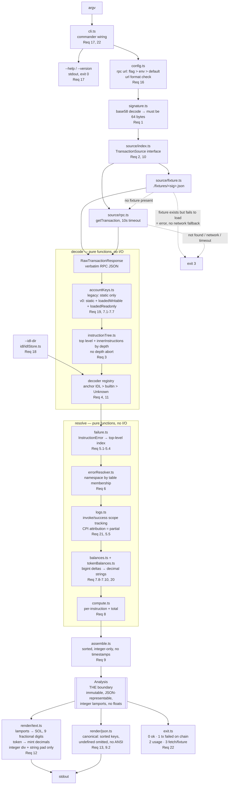

# Design Document

## Overview

Opsis is a read-only CLI that takes one Solana transaction signature and prints
what happened, with emphasis on why it failed. It runs as a single pass with no
interactive state and no persistence.

The pipeline has exactly one shape:

```
argv → config → signature validation → transaction source (fixture | RPC)
     → decode → resolve → Analysis → render (text | JSON) → exit code
```

Everything left of `Analysis` produces data. Everything right of it consumes
data. `Analysis` is the only boundary, and it is a plain immutable data
structure with no methods, no class instances, no `Date`, no `Map`, and no
floating-point numbers. That restriction is what makes the golden tests
meaningful: a fixture's `expected.json` is the canonical serialization of an
`Analysis`, so a test can assert the tool's entire semantic output without ever
touching terminal formatting or color codes.

Three product invariants shape every module below.

**Read-only is a call-site guarantee, not an import restriction.**
`@solana/web3.js` is mandated by tech.md and legitimately exports `Transaction`,
`sendTransaction`, and simulation helpers. Opsis does not ban the package; it
bans the call. A test asserts the absence of those call sites across `src/`
(Requirement 15). Restricting imports would be both impossible and misleading.

**Determinism is structural.** No randomness, no clock, no locale-sensitive
formatting, no directory-order dependence, and no numeric type that could round.
Numbers are integers or decimal strings. Lamports and token amounts, which
exceed `Number.MAX_SAFE_INTEGER`, are decimal strings computed with `bigint`
arithmetic and narrowed back to strings at the boundary.

**Degradation is explicit.** Every decoded object in `Analysis` carries a
`Confidence` marker of `full`, `partial`, or `raw`. The type system enforces
this: there is no constructor for a decoded instruction, error, balance, or log
attribution that omits the marker. An unknown program yields a `raw` node
carrying its instruction bytes as hex, never a guess.

### What this design deliberately does not contain

No transaction simulation, no source-line mapping, no HTTP server or web UI, no
chain other than Solana, no indexing or monitoring, and no on-chain IDL fetch.
IDLs come from a local directory only (Requirement 18).

---

## Architecture



Two properties of this graph matter more than the individual boxes.

**The decode and resolve stages are pure.** Both take the verbatim RPC response
plus the loaded IDL map and return data. All I/O — argv, environment, file
system, network, stdout, stderr, process exit — lives in `cli.ts`,
`config.ts`, `source/`, and `exit.ts`. That is what lets a golden test drive the
full pipeline from a JSON file with the network unplugged and no internal
mocking.

**The renderers are sinks.** They read `Analysis` and return a string. They
never write back into it, never re-fetch, and never make a decision that decode
should have made. If the text renderer needs a token's `decimals` to format an
amount, that value must already be in `Analysis` alongside the raw amount, or
the renderer must fall back to base units with `partial` confidence — it has
nowhere else to look, by construction.

---

## Components and Interfaces

Module paths are relative to `src/`. Every interface is `export`ed; ES module
syntax, TypeScript strict mode.

### `cli.ts` — entry and argument parsing

Satisfies Requirements 1.4, 1.5, 17, 22.5, 22.6.

Owns the only `process.argv`, `process.exit`, `process.stdout`, and
`process.stderr` references in the codebase. Wires `commander` for the
positional signature and the flags `--json`, `--rpc-url`, `--idl-dir`,
`--version`, `--help`. Configures commander to route its own error and usage
output to stderr rather than the default mixed streams (Req 22.5), and handles
`--version` before `--help` when both are present (Req 17.7).

```ts
export interface CliOptions {
  readonly signature: string;
  readonly json: boolean;
  readonly rpcUrl: string | undefined;
  readonly idlDir: string | undefined;
}

export function parseArgv(argv: readonly string[]): ParseResult;
export async function main(argv: readonly string[]): Promise<ExitCode>;
```

`main` returns an exit code rather than calling `process.exit`, so a test can
drive the whole program without terminating the test runner. The thin
`bin/opsis.js` shim is the only place `process.exit` is invoked.

### `signature.ts` — signature validation

Satisfies Requirements 1.1, 1.2, 1.3.

Validation is base58 decode followed by a byte-length check of exactly 64. It is
never a character count: base58 length varies with leading zero bytes, so a
character count both rejects valid signatures and accepts invalid ones.

```ts
export type SignatureError =
  | { readonly kind: 'not-base58'; readonly message: string }
  | { readonly kind: 'wrong-length'; readonly byteLength: number };

export function validateSignature(
  input: string,
): { ok: true; signature: Base58Signature } | { ok: false; error: SignatureError };
```

### `config.ts` — endpoint and IDL directory configuration

Satisfies Requirement 16.

Resolves the RPC URL with precedence `--rpc-url` > `OPSIS_RPC_URL` >
`https://api.mainnet-beta.solana.com`, then validates it against
`scheme://host[:port][/path]` before any request is issued. An invalid URL is a
usage error: stderr, exit 2 (Req 16.5). The chosen endpoint is logged to stderr
(Req 16.7) — stderr specifically, so that `opsis SIG --json | jq` stays clean.

```ts
export interface ResolvedConfig {
  readonly rpcUrl: string;
  readonly idlDir: string | undefined;
  readonly fixtureDir: string;
  readonly requestTimeoutMs: 10_000;
}

export function resolveConfig(
  options: CliOptions,
  env: Readonly<Record<string, string | undefined>>,
): { ok: true; config: ResolvedConfig } | { ok: false; error: ConfigError };
```

`requestTimeoutMs` is typed as the literal `10_000`. There is exactly one
timeout value in Opsis and the type system pins it there; no other module may
introduce a second one.

### `source/` — transaction source

Satisfies Requirements 2, 10, 16.6.

One interface, two implementations, and a composite that sequences them.

```ts
export interface TransactionSource {
  fetch(signature: Base58Signature): Promise<SourceResult>;
}

export type SourceResult =
  | { readonly ok: true; readonly response: RawTransactionResponse }
  | { readonly ok: false; readonly error: SourceError };

export type SourceError =
  | { readonly kind: 'not-found' }
  | { readonly kind: 'network'; readonly detail: string }
  | { readonly kind: 'timeout'; readonly timeoutMs: number }
  | { readonly kind: 'unreachable'; readonly endpoint: string }
  | { readonly kind: 'fixture-unreadable'; readonly path: string; readonly detail: string };
```

`FixtureSource` (`source/fixture.ts`) reads `<fixtureDir>/<signature>.json`
containing the verbatim recorded RPC response (Req 10.1, 10.2).

`RpcSource` (`source/rpc.ts`) calls `getTransaction` through
`@solana/web3.js` with `maxSupportedTransactionVersion: 0` and an
`AbortSignal.timeout(10_000)`.

`CompositeSource` encodes the fixture semantics that Requirements 2.6/2.8 and
10.3/10.4 draw a sharp line between:

- Fixture file absent → fall through to `RpcSource`.
- Fixture file present and loads → use it, no network request.
- Fixture file present and fails to load for any reason (malformed JSON,
  corruption, permissions) → `fixture-unreadable` carrying the path and the
  reason. **No network fallback.** Silently reaching the network when a
  fixture was supposed to answer would destroy offline reproducibility and
  make a corrupt fixture look like a passing test.

`RawTransactionResponse` is a structural type over the RPC JSON shape, not a
web3.js class. Decode reads the response as data so that a fixture file and a
live response are literally the same input (Req 10.5).

### `decode/accountKeys.ts` — account key resolver

Satisfies Requirements 7.1–7.7, 19.

Builds the effective account key list and the role of every entry.

```ts
export interface EffectiveKeys {
  readonly messageVersion: MessageVersion;
  readonly staticCount: number;
  readonly entries: readonly AccountEntry[];
  readonly loadedAddressesAvailable: boolean;
}

export function resolveAccountKeys(response: RawTransactionResponse): EffectiveKeys;
export function resolveAccountRef(keys: EffectiveKeys, index: number): AccountRef;
```

Ordering is fixed: static keys, then loaded writable, then loaded readonly
(Req 19.3). Roles come from two different sources and the code keeps them
separate:

| Entry origin | signer | writable / readonly |
| --- | --- | --- |
| static key | message header | message header |
| loaded writable | always `false` | `writable` |
| loaded readonly | always `false` | `readonly` |

The message header governs static keys only (Req 7.4). A lookup-table address
takes its role from which `loadedAddresses` array it appeared in, and is never a
signer (Req 7.5–7.7) — a signature covers the static key list, so an address
that was not in the message at signing time cannot have signed it.

`resolveAccountRef` is the single point of index resolution and it cannot read
out of bounds: an index at or beyond `entries.length` returns an `unresolved`
ref. When the message is v0 and `loadedAddresses` is absent, every index at or
beyond `staticCount` returns `unresolved` with `raw` confidence and a reason
naming the unavailable lookup data (Req 19.6).

### `decode/instructionTree.ts` — instruction tree builder

Satisfies Requirement 3.

Merges `message.instructions` with `meta.innerInstructions` into a recursive
tree. Inner instructions carry a `stackHeight` in the RPC response; the builder
reconstructs parentage from that, attaching each inner instruction to the most
recent open node at `stackHeight - 1`. Where `stackHeight` is absent (older
responses) all inner instructions for an index are attached as direct children
of that top-level instruction and marked `partial`.

```ts
export function buildInstructionTree(
  response: RawTransactionResponse,
  keys: EffectiveKeys,
): readonly InstructionNode[];
```

There is no depth limit and no depth-based abort (Req 3.6). Whatever depth the
runtime executed is what gets rendered. `order` is a single global counter
assigned in transaction appearance order across all depths (Req 3.4), and each
node records `depth` and `parentOrder` (Req 3.3).

Two distinct failure modes are kept distinct, because Requirement 3 separates
them:

- **Undecodable instruction data** (Req 3.5): the node exists, an error
  indicator is recorded, raw bytes are preserved. `valid` stays `true` — the
  instruction is real, we just could not read its payload.
- **Unresolvable program ID** (Req 3.7): the program index resolves to neither a
  static key nor a loaded address. The node is recorded as successfully decoded
  with `valid: false` and a `reason` naming the unresolved program index. A
  program ID resolved via `loadedAddresses` sets `valid: true` (Req 3.8).

### `decode/registry.ts` — instruction decoder registry

Satisfies Requirements 4, 7.12, 7.13, 11.

```ts
export interface InstructionDecoder {
  readonly source: DecoderSource;
  readonly programId: Base58Address;
  decode(data: Uint8Array, accounts: readonly AccountRef[]): DecodeOutcome;
}

export type DecodeOutcome =
  | { readonly kind: 'full'; readonly name: string; readonly fields: readonly DecodedField[] }
  | { readonly kind: 'partial'; readonly name: string; readonly fields: readonly DecodedField[]; readonly remaining: Uint8Array }
  | { readonly kind: 'no-match' }
  | { readonly kind: 'error'; readonly detail: string };

export function createRegistry(
  idls: IdlStore,
): { decodeFor(programId: Base58Address | null, data: Uint8Array, accounts: readonly AccountRef[]): InstructionDecode };
```

Resolution order, exactly as Requirement 4 specifies:

1. Anchor IDL for the program, matched by 8-byte instruction discriminator
   (Req 4.1). IDL wins over a built-in when both exist (Req 4.6).
2. Built-in decoder (Req 4.2), including when an IDL exists but has no matching
   discriminator (Req 4.7).
3. `Unknown` with raw data preserved (Req 4.3, 11.1).

Built-in decoders ship for System Program
(`11111111111111111111111111111111`), SPL Token
(`TokenkegQfeZyiNwAJbNbGKPFXCWuBvf9Ss623VQ5DA`), and SPL Associated Token
Account (`ATokenGPvbdGVxr1b2hvZbsiqW5xWH25efTNsLJA8knL`) (Req 4.4), each in its
own file under `decode/builtin/`.

The registry is the sole producer of `InstructionDecode`, whose three variants
carry `confidence: 'full' | 'partial' | 'raw'` as a literal type. Setting the
marker is not a separate step a future contributor can forget: it is baked into
the variant (Req 4.5, 11.2, 11.3, 11.7).

Truncation of raw data (Req 11.6) reads as: data longer than 256 **bytes** is
hex-encoded for its first 256 bytes, and `"... (truncated)"` is appended, with
`truncated: true` and the true `byteLength` recorded so the reader knows how
much was withheld.

### `decode/idl/idlStore.ts` — Anchor IDL loading

Satisfies Requirement 18.

The `--idl-dir` flag is accepted by `cli.ts` and passed through `ResolvedConfig`
(Req 18.1). This module loads every `*.json` file from that directory and indexes it by
`metadata.address` (Req 18.2, 18.3). A file with invalid JSON, or missing any of
`version`, `name`, `instructions`, `metadata.address`, produces a warning on
stderr naming the path and the reason, and loading continues (Req 18.4). One bad
IDL never fails the run.

```ts
export interface IdlStore {
  get(programId: Base58Address): LoadedIdl | undefined;
  readonly warnings: readonly IdlWarning[];
}

export function loadIdlDirectory(dir: string): Promise<IdlStore>;
```

Files are sorted by name before loading, so two runs over the same directory
produce the same warning order regardless of file system enumeration order
(Req 9.6).

### `resolve/failure.ts` — failing instruction identification

Satisfies Requirement 5.

`meta.err` in the form `{ InstructionError: [index, detail] }` carries a
**top-level** instruction index only. That is a property of the runtime error
payload, not a limitation of this tool, and the design does not pretend
otherwise: the index marks the top-level node (Req 5.2), and any attribution to
a nested CPI comes from the program logs and carries `partial` confidence
(Req 5.5).

```ts
export function locateFailure(
  response: RawTransactionResponse,
  tree: readonly InstructionNode[],
  logs: LogAttribution,
): FailureReport | null;
```

An index beyond the top-level count records an error indicator and preserves the
out-of-range value rather than clamping it (Req 5.4). A successful transaction
forces `failed: false` on every node, overriding anything set earlier
(Req 5.3).

### `resolve/errorResolver.ts` — error namespace resolution

Satisfies Requirement 6.

```ts
export interface ErrorTable {
  readonly namespace: ErrorNamespace;
  lookup(code: number): { readonly name: string; readonly message: string } | undefined;
}

export function resolveError(
  err: RawTransactionError,
  failingProgramId: Base58Address | null,
  idls: IdlStore,
): ResolvedError;
```

Resolution order:

1. Code ≥ 6000 → the failing program's Anchor IDL `errors` array (Req 6.1). No
   IDL for that program → `raw`, numeric code only, no message (Req 6.5).
2. Code in 2000–5999 → the Anchor framework table (Req 6.2).
3. Otherwise, if the failing program is System Program, SPL Token, or SPL ATA,
   consult that program's table — **by membership, not by numeric range**
   (Req 6.3). These programs number their errors from low values that overlap
   each other, so a range test would attribute an error to the wrong program.
   Membership in the specific failing program's table is the only sound test.
4. Not found anywhere → `raw`, numeric code, no message (Req 6.6, 6.10). A code
   from a program whose table we hold but which is absent from that table
   resolves as `raw`; inventing a plausible message would be exactly the
   guessing the product forbids.
5. Code unparseable as an integer → parse error recorded, `raw` (Req 6.9).

The program ID used to select the namespace is always the failing instruction's
program (Req 6.8).

Tables live in `resolve/tables/` as plain frozen objects, one file per
namespace: `anchorFramework.ts`, `systemProgram.ts`, `splToken.ts`,
`splAssociatedTokenAccount.ts`.

### `resolve/logs.ts` — log attributor

Satisfies Requirement 21, and feeds Requirement 5.5.

Walks `meta.logMessages`, opening an instruction scope on an
`Program <id> invoke [n]` marker and closing it on the matching `success`
marker, maintaining a stack (Req 21.2). Every attribution produced this way is
`partial` (Req 21.3) — the markers are a strong signal but they are text emitted
by programs, not a structured guarantee.

```ts
export interface LogAttribution {
  readonly byInstructionOrder: ReadonlyMap<number, readonly AttributedLog[]>;
  readonly unattributed: readonly string[];
  readonly truncated: boolean;
  readonly present: boolean;
}

export function attributeLogs(
  response: RawTransactionResponse,
  tree: readonly InstructionNode[],
): LogAttribution;
```

Messages that cannot be placed go to `unattributed` (Req 21.4) rather than being
force-fit to the nearest instruction. A truncation marker sets `truncated` and
`partial` confidence on the collection (Req 21.5). An absent `logMessages` field
yields an empty collection with `raw` confidence (Req 21.6). The
`ReadonlyMap` exists only inside this module; `assemble.ts` flattens it into
arrays on the nodes, because `Analysis` contains no `Map`.

### `analyze/balances.ts` — lamport balance deltas

Satisfies Requirements 7.8–7.11.

Zips `meta.preBalances` with `meta.postBalances` by account index. Both present
→ `delta = post - pre` computed in `bigint` and recorded as a decimal string.
Pre absent, post present → post only, no delta (Req 7.9). No unit conversion
happens here or anywhere else in the analysis layer (Req 7.10). Each entry also
records the instruction orders that referenced the account (Req 7.11).

### `analyze/tokenBalances.ts` — SPL token balance deltas

Satisfies Requirement 20.

Matches pre and post `Token_Balance_Entry` values on the pair
(`accountIndex`, `mint`) (Req 20.2). Deltas are computed on the raw base-unit
amount strings via `bigint` and recorded as decimal strings (Req 20.3, 20.7).
Post with no pre → delta is the post amount, `lifecycle: 'created'`
(Req 20.5). Pre with no post → delta is the negated pre amount,
`lifecycle: 'closed'` (Req 20.6). Both fields absent → empty collection
(Req 20.9).

Every amount is carried as a `TokenAmount`, which binds the raw amount to its
mint and its `decimals` in one value (Req 20.4). The RPC's convenience
`uiAmount` field is a float and is discarded on read — it never enters
`Analysis` (Req 20.8).

Entries are sorted by (`accountIndex`, `mint`) so ordering is independent of the
order the RPC happened to list them (Req 9.2, 9.6).

### `analyze/compute.ts` — compute unit extraction

Satisfies Requirement 8, including the requirement that both per-instruction and
total values appear in `Analysis` (Req 8.3).

Per-instruction units come from the `consumed N of M compute units` log line
attributed to that instruction; the total comes from
`meta.computeUnitsConsumed`. Unavailable data yields the `available: false`
variant carrying `raw` confidence rather than a zero (Req 8.2), while a genuine
zero is reported as `0` (Req 8.4).

The total is taken verbatim from metadata and is **not** cross-checked against
the sum of per-instruction values (Req 8.5). Transaction-level overhead is not
attributed to any instruction, so the total is not expected to equal the sum,
and asserting otherwise would produce false failures on correct data.

### `analyze/assemble.ts` — Analysis assembly

Satisfies Requirement 9, and Requirement 11.2/11.4 in aggregate.

The single pure function that composes every stage above into the final object.

```ts
export function assembleAnalysis(input: AnalysisInput): Analysis;
```

Its responsibilities are the determinism guarantees that no single upstream
module can own alone: sort every collection by its declared key, flatten maps
into arrays, and exclude any field that varies between runs. Notably `Analysis`
records **no** indication of whether data came from a fixture or the network,
because Requirement 10.5 demands identical output from both. It also carries no
timestamp, process ID, or duration (Req 9.5).

### `render/text.ts` — Text_Renderer

Satisfies Requirement 12.

Consumes `Analysis`, returns a string. Sections for transaction metadata,
instruction tree, and account state separated by blank lines (Req 12.1), two
spaces of indentation per tree level (Req 12.2).

Color support is decided once, in order (Req 12.8): `NO_COLOR` set → off;
stdout not a TTY → off; otherwise on when `COLORTERM` is set or `TERM`
indicates a color-capable terminal. `picocolors` performs its own detection, so
the renderer computes the decision explicitly and passes a `ColorMode` in,
rather than letting an implicit environment read make output untestable. With
color off, the text markers `[FAIL]`, `[ERROR]`, and uppercase account role
labels are used instead (Req 12.6, 12.9). Distinct colors are assigned to
instruction types, account roles, error messages, and failing instructions, with
no two categories sharing a color (Req 12.3, 12.4).

Numeric formatting lives in `render/decimal.ts` and is the only place in the
codebase that produces a fractional value:

```ts
export function formatFixedPoint(raw: string, fractionalDigits: number): string;
export function formatLamportsAsSol(lamports: LamportAmount): string;
export function formatTokenAmount(amount: TokenAmount): FormattedTokenAmount;
export function groupThousands(integerPart: string): string;
```

`formatFixedPoint` splits a decimal integer string into integer and fractional
parts using `bigint` division and remainder plus string padding. No
`Number()`, no `/`, no `toFixed`, no `parseFloat` (Req 12.10, 12.12).
`formatLamportsAsSol` is `formatFixedPoint(v, 9)` — exactly nine fractional
digits (Req 12.5).

Token amounts are different and the difference is load-bearing:
`formatTokenAmount` uses that mint's `decimals`, never a fixed nine, never a
default, and never an inferred value (Req 12.11, 12.14). Because
`TokenAmount.decimals` is a discriminated union, the renderer cannot read a
number without first handling the unknown case, where it emits the raw
base-unit integer, labels it as base units, and attaches `partial` confidence
(Req 12.13).

### `render/json.ts` — JSON_Renderer

Satisfies Requirement 13, and Requirement 9.2.

```ts
export function renderJson(analysis: Analysis): string;
```

A canonical serializer: keys sorted lexicographically at every level, keys whose
value is `undefined` omitted, keys whose value is `null` preserved, UTF-8, no
ANSI sequences, RFC 8259 conformant (Req 13.1, 13.2, 13.5, 13.7, 9.2). Because
`Analysis` contains only strings, finite integers, booleans, `null`, arrays, and
plain objects, serialization is total — there is no value in the type that JSON
cannot represent — and it is a structural pass-through, so every field including
every `Confidence` marker survives (Req 13.3). The serialization-failure path
(Req 13.6) is retained as a defensive guard that reports to stderr.

Balances are emitted in raw lamport units with no SOL conversion applied
(Req 13.8). SOL is a text-renderer concern and appears nowhere in JSON output.

### `exit.ts` — exit code and stream policy

Satisfies Requirement 22.

```ts
export const enum ExitCode {
  Success = 0,
  TransactionFailed = 1,
  UsageError = 2,
  FetchError = 3,
}

export function exitCodeFor(outcome: ProgramOutcome): ExitCode;
export function writeDiagnostic(message: string): void; // stderr, always
```

Exit code 1 is a signal, not an error: the tool worked perfectly and the
transaction it analyzed failed on chain. The analysis is still written to stdout
in that case, which is the whole point of the tool. `writeDiagnostic` is the
only sanctioned path for diagnostics, warnings, errors, and error-path usage
output, all of which go to stderr (Req 22.5). stdout carries only the rendered
analysis, `--version` output, and `--help` output (Req 22.6).

### `scripts/recordFixture.ts` — fixture recorder (dev-only tooling)

**Not part of the shipped CLI.** This is maintainer tooling that produces the
recorded responses the golden tests and `FixtureSource` consume. It is described
here because the fixtures it writes are a contract of the test strategy, and a
reviewer should be able to see exactly what produced them.

It walks `getSignaturesForAddress` for a given program address, pages through the
results, keeps only entries whose `err` field is non-null, fetches each with
`getTransaction`, and writes two files per case: the verbatim response to
`fixtures/<name>/input.json`, and a `meta.json` alongside it recording what the
case covers, the cluster it was recorded from, and the date it was recorded.

```ts
export interface RecordOptions {
  readonly programAddress: Base58Address;
  readonly rpcUrl: string;
  /** Page size / cap on candidate signatures examined. */
  readonly limit: number;
  /** Destination root, e.g. "tests/golden" or "fixtures". */
  readonly outDir: string;
  /** Directory name for the case, e.g. "02-anchor-user-error". */
  readonly caseName: string;
  readonly cluster: 'mainnet-beta' | 'devnet' | 'testnet' | 'localnet';
  /** What this case is meant to prove. Written verbatim into meta.json. */
  readonly covers: string;
  /** ISO date, supplied by the caller rather than read from a clock. */
  readonly recordedOn: string;
}

/** Serialized to <outDir>/<caseName>/meta.json. Never read by the pipeline. */
export interface FixtureMeta {
  readonly case: string;
  readonly covers: string;
  readonly cluster: RecordOptions['cluster'];
  readonly recordedOn: string;
  readonly signature: Base58Signature;
}

export interface RecordedFixture {
  readonly signature: Base58Signature;
  readonly inputPath: string;
  readonly metaPath: string;
}

export async function recordFailedTransactions(
  options: RecordOptions,
): Promise<readonly RecordedFixture[]>;
```

`meta.json` is documentation for the next maintainer. Nothing in `src/` reads it,
so it cannot influence `Analysis` and cannot affect a golden comparison. The
recording date is passed in rather than read from a clock, which keeps the script
free of a time dependency and keeps the written bytes reproducible for a given
invocation.

Four constraints govern this script, and each is a deliberate decision rather
than an accident of layout.

**It lives outside `src/`, under `scripts/`.** Two concrete reasons. First, the
Requirement 15 read-only AST guard scans `src/`, and the recorder is not part of
the shipped surface, so including it in the guarded tree would conflate "code we
ship" with "code we run by hand." Second, keeping it outside `src/` is what makes
the package exclusion mechanical rather than a matter of discipline — the
exclusion follows from the directory, not from someone remembering to add an
entry.

**It is excluded from the published npm package via the `files` allowlist in
package.json.** An allowlist, not `.npmignore`. With an allowlist, a new dev
script is excluded by default and can only ship if someone explicitly adds it;
with an ignore list, a new dev script leaks into the package by omission, which
is exactly the failure mode that is easy to miss in review.

**It is the only component permitted to make an unsolicited network call.**
Every other network call in the system is made in direct response to a
user-supplied signature: one `getTransaction` for the signature the user typed.
The recorder is the sole exception, because enumerating candidate transactions is
inherently a search rather than a lookup.

**It is never invoked by the test suite.** The suite runs with the network
interceptor active, and the recorder would fail there by design. Recording is a
deliberate manual maintainer step, run once per fixture, with the result
committed.

The recorder performs no transaction construction, no signing, and no
submission. It is read-only in the Requirement 15 sense even though it sits
outside the guarded tree: the AST guard's scope is `src/`, and a reviewer
checking the read-only claim should understand the recorder as read-only by
inspection — it is two RPC read calls and two file writes, and nothing else.
Both `getSignaturesForAddress` and `getTransaction` are read-only RPC methods,
so the recorder introduces no new capability class beyond what the CLI already
uses.

---

## Data Models

This is the contract. `expected.json` in every fixture directory is the
canonical serialization of one `Analysis`, so a change to any type here is a
change to every golden file, deliberately.

### Design decisions encoded in the types

**Lamports and token amounts are decimal `string`s, not `number` and not
`bigint`.** `number` is disqualified outright: a `u64` lamport value reaches
~1.8 × 10¹⁹ and total SOL supply already exceeds 2⁵³, so `number` silently
rounds real balances. Between `string` and `bigint`, `string` wins because
`Analysis` exists to be compared against a JSON file: `bigint` is not
JSON-representable, so it would force a custom serializer *and* a custom
precision-safe parser on the golden path, and `JSON.parse` of a large integer
literal loses precision before any reviver can intervene. A decimal string
survives `JSON.parse` and `JSON.stringify` byte-for-byte with no special
handling. Requirement 9.2 explicitly sanctions "an integer or a decimal string",
and Requirement 13.8's mandate is raw lamport *units* with no SOL conversion,
which decimal strings satisfy exactly. Arithmetic is still exact: deltas are
computed in `bigint` and narrowed back to a string at the boundary. The
type-level bonus is that a float cannot be assigned to a `string` field, so
Requirements 9 and 20.8 are enforced by the compiler rather than by discipline.

**Small bounded counts stay `number`.** Account indices, instruction order,
depth, byte lengths, error codes (`u32`), and compute units (capped at 1.4M per
instruction) all fit safely and are typed `number` so ordinary comparison and
indexing work.

**Confidence is a literal type on the variant, not an optional field.** Each
decode variant pins `confidence` to a single literal. There is no inhabitant of
these types that lacks a marker, which is how Requirement 11.4 is guaranteed
rather than merely tested.

**Absence has two spellings, and they mean different things.** A field typed
`T | null` is always present and `null` states "we looked and it is not there" —
meaningful absence the reader should see. A field typed `?: T` is omitted from
the serialization when `undefined`, per Requirement 13.7.

### Confidence propagation rule

The `Confidence` type guarantees that every decoded element carries a marker. It
cannot express what an *aggregate's* marker means, and that is a semantic rule
the design has to state.

Confidence is ordered:

```
full > partial > raw
```

A container's confidence is the **minimum**, under that ordering, of its own
intrinsic confidence and the confidence of every one of its children. Applied
recursively, this makes a container's marker a lower bound on everything beneath
it.

Concrete consequences:

- An instruction with any `partial` argument is itself at most `partial`, even
  when its name resolved cleanly.
- A transaction containing any `raw` instruction is at most `partial`.
- An instruction whose own decode is `full` but which contains a `raw` nested CPI
  is at most `partial`.

Confidence is **never upgraded** during aggregation. Propagation is monotonically
non-increasing as it moves up the tree: a parent can only ever be equal to or
weaker than the weakest thing it contains.

```ts
// src/model/confidence.ts

/** Rank for comparison only. Never serialized. */
const RANK: Readonly<Record<Confidence, number>> = { full: 2, partial: 1, raw: 0 };

/** Fold over a container's own marker plus its children's markers. */
export function minConfidence(
  own: Confidence,
  children: readonly Confidence[],
): Confidence {
  return children.reduce(
    (acc, c) => (RANK[c] < RANK[acc] ? c : acc),
    own,
  );
}
```

`assemble.ts` is the single place propagation happens. It walks the assembled
tree bottom-up and rewrites each container's `confidence` with
`minConfidence(intrinsic, childMarkers)` — instruction nodes fold their decode,
account references, and nested instructions; the log report folds its
attributions. A component author producing an instruction node sets only that
node's intrinsic marker and cannot forget the aggregation step, because the
aggregation is not theirs to perform.

The reasoning is the honest degradation rule in product.md: an aggregate that
reported `full` while containing a `raw` child would present a partial decode as
complete, which is precisely the claim the product forbids.

The asymmetry is deliberate. A container with a `raw` child is capped at
`partial`, not dropped to `raw`, because the container genuinely did decode its
own layer — the program was identified, the instruction was named, the accounts
resolved. Reporting the whole node as wholly unread would understate what is
actually known, which is its own kind of dishonesty.

```ts
// src/model/analysis.ts

/**
 * Decode completeness for a single element of the Analysis object.
 * Every decoded element carries one. Requirement 11.2, 11.4.
 */
export type Confidence = 'full' | 'partial' | 'raw';

/** Base58-encoded account address. Requirement 7.14. */
export type Base58Address = string;

/** Base58-encoded 64-byte transaction signature. Requirement 1.1. */
export type Base58Signature = string;

/** Lowercase hex, "0x" prefixed. Requirement 11.5. */
export type HexString = string;

/**
 * Signed decimal integer string in lamports. Never a float, never SOL.
 * Requirements 7.10, 9.2, 13.8.
 */
export type LamportAmount = string;

/**
 * Signed decimal integer string in a mint's smallest base unit.
 * Meaningless without the matching decimals value; never carried alone.
 * Requirements 20.7, 20.8.
 */
export type RawTokenAmount = string;

export type MessageVersion = 'legacy' | 'v0';

// ---------------------------------------------------------------------------
// Root
// ---------------------------------------------------------------------------

/**
 * The single boundary between decode and render.
 *
 * Contains only strings, safe integers, booleans, null, arrays, and plain
 * objects. No Date, no Map, no class instance, no floating-point number.
 * Contains no indication of whether the data came from a fixture or the
 * network, because both must produce identical output (Requirement 10.5), and
 * no timestamp, process id, or duration (Requirement 9.5).
 */
export interface Analysis {
  readonly signature: Base58Signature;
  /** Requirement 19.1. */
  readonly messageVersion: MessageVersion;
  readonly outcome: TransactionOutcome;
  /** Effective account key list, in effective order. Requirement 19.2, 19.3. */
  readonly accountKeys: readonly AccountEntry[];
  /** Top-level instructions, ascending by order. Requirement 3.4. */
  readonly instructions: readonly InstructionNode[];
  /** Non-null exactly when the transaction failed. Requirement 5. */
  readonly failure: FailureReport | null;
  /** Ascending by accountIndex. Requirement 7.8, 7.9. */
  readonly lamportBalances: readonly LamportBalanceChange[];
  /** Ascending by (accountIndex, mint). Requirement 20. */
  readonly tokenBalances: readonly TokenBalanceChange[];
  readonly compute: ComputeReport;
  readonly logs: LogReport;
}

export interface TransactionOutcome {
  /** false implies exit code 1. Requirement 22.1, 22.2. */
  readonly succeeded: boolean;
  /** Requirement 6.4. */
  readonly error: ResolvedError | null;
}

// ---------------------------------------------------------------------------
// Accounts — Requirements 7, 19
// ---------------------------------------------------------------------------

export type AccountRole = 'writable' | 'readonly';

/**
 * Where an address came from, which determines how its role was derived.
 * Requirements 7.4-7.7, 19.7.
 */
export type AccountOrigin =
  | { readonly kind: 'static' }
  | {
      readonly kind: 'lookup-table';
      /** Which loadedAddresses array the address appeared in. */
      readonly loadedFrom: 'writable' | 'readonly';
    };

export interface AccountEntry {
  /** Position in the effective account key list. */
  readonly index: number;
  readonly address: Base58Address;
  /** Always false for lookup-table addresses. Requirement 7.7. */
  readonly signer: boolean;
  /** Header for static keys; source array for lookup-table addresses. */
  readonly role: AccountRole;
  readonly origin: AccountOrigin;
  /** Instruction orders referencing this account, ascending. Requirement 7.11. */
  readonly referencedBy: readonly number[];
  /** From an Anchor IDL when available. Requirement 7.12, 7.13. */
  readonly name: string | null;
  readonly confidence: Confidence;
}

/**
 * One account slot of one instruction. The 'unresolved' variant is the only
 * outcome for an out-of-range index, so index resolution cannot read past the
 * end of the effective key list. Requirement 19.5, 19.6.
 */
export type AccountRef =
  | {
      readonly kind: 'resolved';
      readonly index: number;
      readonly address: Base58Address;
      readonly signer: boolean;
      readonly role: AccountRole;
      readonly origin: AccountOrigin;
      readonly name: string | null;
      readonly confidence: Confidence;
    }
  | {
      readonly kind: 'unresolved';
      readonly index: number;
      /** e.g. loaded addresses unavailable for a v0 message. */
      readonly reason: string;
      readonly confidence: 'raw';
    };

// ---------------------------------------------------------------------------
// Instructions — Requirements 3, 4, 5, 8, 11, 21
// ---------------------------------------------------------------------------

export type DecoderSource = 'anchor-idl' | 'builtin';

/**
 * Raw instruction bytes, preserved whenever decoding is incomplete.
 * Requirements 11.1, 11.5, 11.6.
 */
export interface RawData {
  readonly label: 'raw_instruction_data';
  /** "0x"-prefixed hex; first 256 bytes only when truncated is true. */
  readonly hex: HexString;
  /** True length in bytes, before any truncation. */
  readonly byteLength: number;
  readonly truncated: boolean;
}

/**
 * A decoded parameter value. There is deliberately no f32/f64 variant: an IDL
 * float field decodes to 'unsupported', which forces the instruction to
 * 'partial'. Requirements 9.2, 9.3.
 */
export type DecodedValue =
  | { readonly type: 'bool'; readonly value: boolean }
  | { readonly type: 'u8' | 'u16' | 'u32' | 'i8' | 'i16' | 'i32'; readonly value: number }
  | { readonly type: 'u64' | 'u128' | 'i64' | 'i128'; readonly value: string }
  | { readonly type: 'string'; readonly value: string }
  | { readonly type: 'pubkey'; readonly value: Base58Address }
  | { readonly type: 'bytes'; readonly value: HexString }
  | { readonly type: 'lamports'; readonly value: LamportAmount }
  | { readonly type: 'tokenAmount'; readonly value: TokenAmount }
  | { readonly type: 'unsupported'; readonly idlType: string };

export interface DecodedField {
  readonly name: string;
  readonly value: DecodedValue;
}

/**
 * Outcome of decoding one instruction's data. Confidence is pinned per variant,
 * so no inhabitant can omit it. Requirements 4.5, 11.2, 11.3, 11.7.
 */
export type InstructionDecode =
  | {
      readonly kind: 'full';
      readonly name: string;
      readonly source: DecoderSource;
      readonly fields: readonly DecodedField[];
      readonly confidence: 'full';
    }
  | {
      readonly kind: 'partial';
      readonly name: string;
      readonly source: DecoderSource;
      readonly decodedFields: readonly DecodedField[];
      readonly undecodedData: RawData;
      readonly confidence: 'partial';
    }
  | {
      readonly kind: 'raw';
      readonly name: 'Unknown';
      /** Contains "Unknown program" when no decoder or IDL exists. Req 11.1. */
      readonly note: string;
      readonly rawInstructionData: RawData;
      /** Reason a decoder or IDL lookup failed. Requirement 11.7. */
      readonly errorDetail: string | null;
      readonly confidence: 'raw';
    };

export type ComputeUnits =
  | { readonly available: true; readonly value: number; readonly confidence: 'full' }
  | { readonly available: false; readonly confidence: 'raw' };

export interface AttributedLog {
  /** Position in the original logMessages array. */
  readonly index: number;
  readonly message: string;
  /** Marker-based attribution is never better than partial. Req 21.3. */
  readonly confidence: 'partial';
}

/**
 * One instruction, top-level or nested at any depth. `inner` is recursive with
 * no bound, so an arbitrarily deep CPI chain is representable and nothing is
 * truncated on a depth threshold. Requirement 3.6.
 */
export interface InstructionNode {
  /** Global sequential index in transaction appearance order. Req 3.4. */
  readonly order: number;
  /** 0 for top-level. Requirement 3.3. */
  readonly depth: number;
  /** null for top-level. Requirement 3.3. */
  readonly parentOrder: number | null;
  /** null when the program index could not be resolved. Requirement 3.7. */
  readonly programId: Base58Address | null;
  readonly programName: string | null;
  readonly decode: InstructionDecode;
  readonly accounts: readonly AccountRef[];
  /** True only for the top-level index named by InstructionError. Req 5.2, 5.3. */
  readonly failed: boolean;
  /** False only when the program ID is unresolvable. Requirement 3.7, 3.8. */
  readonly valid: boolean;
  /** Names the unresolved program index when valid is false. Requirement 3.7. */
  readonly invalidReason: string | null;
  readonly computeUnits: ComputeUnits;
  readonly logs: readonly AttributedLog[];
  readonly inner: readonly InstructionNode[];
  readonly confidence: Confidence;
}

// ---------------------------------------------------------------------------
// Failure and errors — Requirements 5, 6
// ---------------------------------------------------------------------------

export type ErrorNamespace =
  | 'anchor-user'
  | 'anchor-framework'
  | 'system-program'
  | 'spl-token'
  | 'spl-associated-token-account';

export type UnresolvedErrorReason =
  /** Code >= 6000 but no IDL for the failing program. Requirement 6.5. */
  | 'no-idl'
  /** Absent from the table that governs it. Requirement 6.6, 6.10. */
  | 'not-in-table'
  /** Not parseable as an integer. Requirement 6.9. */
  | 'unparseable-code';

export type ResolvedError =
  | {
      readonly kind: 'resolved';
      readonly code: number;
      readonly namespace: ErrorNamespace;
      readonly name: string;
      readonly message: string;
      readonly programId: Base58Address | null;
      readonly confidence: 'full';
    }
  | {
      readonly kind: 'unresolved';
      /** null when the code could not be parsed. Requirement 6.9. */
      readonly code: number | null;
      /** The code as it appeared, e.g. "0x1771". */
      readonly rawCode: string;
      readonly reason: UnresolvedErrorReason;
      readonly programId: Base58Address | null;
      /** No message field exists on this variant, by construction. Req 6.5, 6.6. */
      readonly confidence: 'raw';
    }
  | {
      readonly kind: 'non-custom';
      /** Variant name taken verbatim from the RPC payload. */
      readonly variant: string;
      readonly detail: string | null;
      readonly confidence: 'full';
    };

/** Attribution of a failure to a nested CPI, inferred from logs. Req 5.5. */
export interface CpiAttribution {
  readonly instructionOrder: number;
  readonly programId: Base58Address;
  /** The log lines the attribution rests on. */
  readonly evidence: readonly string[];
  readonly confidence: 'partial';
}

export interface FailureReport {
  /** Top-level index from InstructionError; preserved even if out of range. */
  readonly failingInstructionIndex: number | null;
  /** True when the index exceeds the top-level count. Requirement 5.4. */
  readonly indexOutOfRange: boolean;
  readonly error: ResolvedError;
  readonly cpiAttribution: CpiAttribution | null;
}

// ---------------------------------------------------------------------------
// Balances — Requirements 7.8-7.10, 20
// ---------------------------------------------------------------------------

export type LamportBalanceChange =
  | {
      readonly kind: 'delta';
      readonly accountIndex: number;
      readonly address: Base58Address;
      readonly pre: LamportAmount;
      readonly post: LamportAmount;
      /** post - pre, computed in bigint. Requirement 7.8. */
      readonly delta: LamportAmount;
      readonly confidence: 'full';
    }
  | {
      readonly kind: 'post-only';
      readonly accountIndex: number;
      readonly address: Base58Address;
      readonly post: LamportAmount;
      /** No delta field exists on this variant. Requirement 7.9. */
      readonly confidence: 'partial';
    };

/**
 * A mint's scale. Modelled as a union so a renderer cannot read a number
 * without handling the unknown case, which is what forces base-unit rendering
 * with partial confidence instead of a silently assumed default.
 * Requirements 12.13, 12.14.
 */
export type TokenDecimals =
  | { readonly known: true; readonly value: number }
  | { readonly known: false };

/**
 * A token amount and its scale, inseparable. A renderer receiving one of these
 * always has the decimals needed to format it, or explicit knowledge that it
 * does not. Requirements 20.4, 12.11.
 */
export interface TokenAmount {
  readonly mint: Base58Address;
  readonly raw: RawTokenAmount;
  readonly decimals: TokenDecimals;
}

export type TokenAccountLifecycle = 'existing' | 'created' | 'closed';

export interface TokenBalanceChange {
  readonly accountIndex: number;
  readonly address: Base58Address;
  readonly mint: Base58Address;
  /** null when the account was created by this transaction. Req 20.5. */
  readonly pre: TokenAmount | null;
  /** null when the account was closed by this transaction. Req 20.6. */
  readonly post: TokenAmount | null;
  /** post - pre, or post, or -pre. Requirement 20.3, 20.5, 20.6. */
  readonly delta: TokenAmount;
  readonly lifecycle: TokenAccountLifecycle;
  readonly confidence: Confidence;
}

// ---------------------------------------------------------------------------
// Compute and logs — Requirements 8, 21
// ---------------------------------------------------------------------------

export interface ComputeReport {
  /**
   * Verbatim from metadata. Not the sum of per-instruction values, and not
   * checked against it. Requirement 8.5.
   */
  readonly total: ComputeUnits;
}

export interface LogReport {
  /** False when logMessages was absent. Requirement 21.6. */
  readonly present: boolean;
  /** Requirement 21.5. */
  readonly truncated: boolean;
  /** Messages that could not be placed. Requirement 21.4. */
  readonly unattributed: readonly string[];
  readonly confidence: Confidence;
}
```

---

## Dependency Justification

tech.md requires a recorded reason per dependency. Major versions should be
verified at install time rather than assumed here; this design pins no version
numbers, and `npm install` records exact resolved versions in the lockfile so
the reviewer's install is reproducible.

| Dependency | Why it is here | Why not hand-rolled |
| --- | --- | --- |
| `@solana/web3.js` | `getTransaction` RPC call and the message/metadata type shapes for legacy and v0 transactions. | Reimplementing the JSON-RPC surface and versioned message types is substantial work with real correctness risk on v0 handling. Opsis uses the read path only; `Transaction`, signing, `sendTransaction`, and simulation are never called (Req 15). |
| `bs58` | Signature validation by decode-to-64-bytes (Req 1) and address encoding for output (Req 7.14). | Base58 with the Bitcoin alphabet is easy to get subtly wrong on leading-zero handling, which is exactly the case that breaks signature validation. |
| `commander` | Positional signature plus flags, `--help` text, unrecognized-flag detection (Req 17). | Argument parsing is where hand-rolled code accumulates edge cases. Commander is configured to send its own errors and usage to stderr per Req 22.5. |
| `picocolors` | Terminal color for the four text-renderer categories (Req 12.3, 12.4). Tiny, zero transitive dependencies. | Raw ANSI codes are writable by hand, but the library is smaller than the constant table would be. Its automatic detection is bypassed: the renderer computes the Req 12.8 decision itself and passes an explicit `ColorMode`. |
| `vitest` | Test runner for golden fixtures, unit tests, and property tests. Native ESM and TypeScript, no build step before tests. | The two-minute reviewer constraint requires `npm install && npm test` to work with no compile step in between. |
| `fast-check` (dev) | Property-based testing for the properties below. Required by the testing strategy; the standard choice for TypeScript and integrates with vitest. | Implementing generators, shrinking, and reproducible seeding by hand is a project of its own and would be worse. |

No runtime dependency is added for JSON canonicalization, decimal formatting, or
Anchor IDL parsing. Canonical serialization is roughly thirty lines over
`Analysis`, whose shape is fully known. Decimal formatting is `bigint` division
plus string padding and must not be delegated to a library that might use
floats. Anchor IDL JSON is read structurally with a validator, since only the
`instructions`, `errors`, `accounts`, and `metadata.address` fields are needed.

---

## Correctness Properties

*A property is a characteristic or behavior that should hold true across all
valid executions of a system — essentially, a formal statement about what the
system should do. Properties serve as the bridge between human-readable
specifications and machine-verifiable correctness guarantees.*

Opsis is a good fit for property-based testing because the decode and resolve
stages are pure functions over a large structured input space, and because the
highest-risk defects are precisely the ones a handful of examples miss: a value
above 2⁵³, a base58 string with leading zero bytes, a CPI nested five deep, an
error code that belongs to two programs' tables, a mint with zero decimals.

Properties are grouped by concern. Each is stated so it can be encoded directly
as a `fast-check` property; the generators referenced are described in the
Testing Strategy.

**Input handling**

### Property 1: Signature encoding round-trips for exactly the 64-byte case

**v1-essential**

*For any* 64-byte buffer `b`, `validateSignature(base58Encode(b))` succeeds and
the accepted signature base58-decodes back to `b` exactly.

**Validates: Requirements 1.1**

### Property 2: Signature rejection is exhaustive over both failure modes

**v1-essential**

*For any* byte buffer whose length is not 64, `validateSignature` of its base58
encoding fails with `kind: 'wrong-length'` reporting the true byte length; and
*for any* string containing at least one character outside the base58 alphabet,
`validateSignature` fails with `kind: 'not-base58'`. In neither case is a
transaction source constructed.

**Validates: Requirements 1.2, 1.3**

### Property 3: Endpoint resolution follows flag over environment over default

*For any* combination of `--rpc-url` present or absent and `OPSIS_RPC_URL`
present or absent, with arbitrary valid URLs in each, the resolved endpoint is
the flag value when the flag is present, otherwise the environment value when it
is present, otherwise `https://api.mainnet-beta.solana.com`.

**Validates: Requirements 16.1, 16.2, 16.3, 16.4**

### Property 4: URL validation gates every request

*For any* string, `resolveConfig` accepts it as an RPC URL if and only if it
matches `scheme://host[:port][/path]`, and when it rejects, no request is ever
issued — verified by supplying a transaction source that throws if invoked.

**Validates: Requirements 16.5**

### Property 5: The flag registry is the single source of truth for the CLI surface

*For any* flag registered with the parser, the `--help` output contains that flag
name followed by a non-empty description; and *for any* flag-shaped string not in
the registered set, the program exits 2, names the offending flag on stderr, and
writes nothing to stdout.

**Validates: Requirements 17.3, 17.6**

**Transaction source**

### Property 6: The source layer transforms nothing and the two sources are interchangeable

*For any* well-formed RPC transaction response document `d`, the `Analysis`
produced by running the pipeline over a fixture file containing `d` is deep-equal
to the `Analysis` produced by running it over a stub RPC endpoint serving `d`.
This forbids any field in `Analysis` that records provenance and any
normalization inside the source layer.

**Validates: Requirements 2.7, 10.2, 10.5**

### Property 7: Fixture absence and fixture unreadability are different outcomes

*For any* signature, if no fixture file exists then the RPC source is invoked
exactly once; and if a fixture file exists but does not parse as an RPC response
document — for any malformed content, including truncated JSON, a wrong root
type, and non-UTF-8 bytes — the result is `fixture-unreadable` naming the file
path and the reason, and the RPC source is invoked exactly zero times.

**Validates: Requirements 2.6, 2.8, 10.1, 10.3, 10.4**

**Instruction tree**

### Property 8: The instruction tree is well-formed and conserves every instruction

*For any* generated transaction response, the flattened node count equals the
number of instructions in the input, the pre-order sequence of `order` values is
exactly `0..n-1`, and every node satisfies either
(`parentOrder === null` and `depth === 0`) or (its parent exists and
`parent.depth === depth - 1`).

**Validates: Requirements 3.1, 3.2, 3.3, 3.4**

### Property 9: No CPI depth threshold exists

*For any* nesting depth `d` in a wide range, building the tree for a chain of
depth `d` completes without throwing and yields a tree whose maximum depth is
exactly `d`, with no node omitted, elided, or replaced by a truncation
placeholder.

**Validates: Requirements 3.6**

### Property 10: Program ID resolvability determines `valid`, and only that

*For any* program index, the resulting node is present in the tree, and `valid`
is `false` with a non-null `invalidReason` if and only if the index resolves to
neither a static key nor a loaded address. An index resolving through
`loadedAddresses` yields `valid: true`.

**Validates: Requirements 3.7, 3.8**

### Property 11: Decoder precedence follows the IDL-then-builtin-then-Unknown ladder

*For any* triple of (IDL present for the program, IDL contains the payload's
discriminator, built-in decoder exists), the decode source is `anchor-idl` when
the first two hold; `builtin` when a built-in exists and either no IDL is present
or the IDL lacks the discriminator; and the `raw` variant named `Unknown`
otherwise.

**Validates: Requirements 4.1, 4.2, 4.6, 4.7**

### Property 12: Every payload byte is accounted for, exactly once

*For any* instruction payload of any length `n`, the decode result accounts for
all `n` bytes: a `full` decode consumes them in its fields; a `partial` decode
carries the unconsumed suffix in `undecodedData` whose hex decodes to exactly
that suffix; a `raw` decode carries the whole payload. In every case the hex is
`0x`-prefixed, labelled `raw_instruction_data`, reports the true `byteLength`,
sets `truncated` to `n > 256`, encodes `min(n, 256)` bytes, and appends
`"... (truncated)"` exactly when truncated. When no decoder or IDL applies, the
note contains `"Unknown program"`; when a lookup fails, `errorDetail` carries the
reason.

**Validates: Requirements 3.5, 4.3, 11.1, 11.3, 11.5, 11.6, 11.7**

**Honest degradation**

### Property 13: Every decoded element carries a confidence marker

**v1-essential**

*For any* `Analysis` value, walking it recursively yields no decoded element —
instruction decode, account entry, account reference, resolved error, CPI
attribution, balance change, token balance change, compute units, attributed
log, or log report — that lacks a `confidence` field, and every such field holds
one of exactly `'full'`, `'partial'`, or `'raw'`.

**Validates: Requirements 4.5, 6.7, 8.2, 11.2, 11.4, 21.3**

### Property 14: CPI failure attribution never overstates and never dangles

*For any* log message sequence, if a `cpiAttribution` is produced then its
`confidence` is `'partial'` and its `instructionOrder` identifies a node that
exists in the tree.

**Validates: Requirements 5.5**

### Property 45: Confidence aggregation is monotonically non-increasing

**v1-essential**

*For any* `Analysis` value and *for any* container node within it — an
instruction node, the log report, or the root — that node's `confidence` is less
than or equal, under the ordering `full > partial > raw`, to the minimum of its
own intrinsic marker and the marker of every one of its descendants; and no
container reports a confidence strictly greater than any descendant's. In
particular, no container is `full` while any descendant is `partial` or `raw`,
and no container is `partial` while its own intrinsic marker is `raw`.

**Validates: Requirements 11.2, 11.3, 11.4**

**Failure and error resolution**

### Property 15: Exactly one top-level instruction is marked failed, and the index is preserved verbatim

*For any* tree and any integer instruction index carried by an
`InstructionError`, `failingInstructionIndex` equals that integer unchanged and
is never clamped; when the index is within the top-level count, exactly one node
in the whole tree has `failed: true` and that node is the index-th node at depth
0; when it is beyond the top-level count, `indexOutOfRange` is `true` and no node
at any depth has `failed: true`.

**Validates: Requirements 5.1, 5.2, 5.4**

### Property 16: Success clears every failure mark

*For any* transaction whose metadata reports no error, `failure` is `null` and no
node at any depth has `failed: true`, regardless of any value assigned earlier in
the pipeline.

**Validates: Requirements 5.3**

### Property 17: Error namespace selection is by table membership, never by numeric range

*For any* pair of a known program (System Program, SPL Token, SPL Associated
Token Account) and an arbitrary integer code below 2000, resolution succeeds with
that program's namespace if and only if the code is a member of that program's
error table; a code present only in a different known program's table resolves as
the `unresolved` variant. *For any* code in 2000–5999 present in the Anchor
framework table, the namespace is `anchor-framework`. *For any* code ≥ 6000 with
an IDL loaded for the failing program that declares it, the namespace is
`anchor-user` and the message equals the IDL's message exactly. In every resolved
case both the numeric code and a non-empty message are present, and the namespace
is always chosen using the failing instruction's program ID.

**Validates: Requirements 6.1, 6.2, 6.3, 6.4, 6.8**

### Property 18: Unresolved errors never carry an invented message

*For any* code ≥ 6000 with no IDL loaded for the failing program, the outcome is
the `unresolved` variant with `reason: 'no-idl'`. *For any* code absent from
every table that governs it, the outcome is `unresolved` with
`reason: 'not-in-table'`. *For any* code representation that is not parseable as
an integer, the outcome is `unresolved` with `reason: 'unparseable-code'` and
`code: null`. In all three cases the serialized object has no `message` key and
`confidence` is `'raw'`.

**Validates: Requirements 6.5, 6.6, 6.9, 6.10**

**Account keys and roles**

### Property 19: The effective account key list is a strict ordered concatenation

*For any* triple of static keys, loaded writable addresses, and loaded readonly
addresses, a v0 message's effective key list equals static ++ loadedWritable ++
loadedReadonly in exactly that order with length equal to the sum of the three
lengths; a legacy message's effective key list equals the static keys alone; and
the recorded `messageVersion` matches the message's version.

**Validates: Requirements 19.1, 19.2, 19.3, 19.4**

### Property 20: Account roles follow origin, and lookup-table addresses are never signers

**v1-essential**

*For any* message header and any static and loaded key lists: every entry with
`origin.kind === 'static'` has `signer` and `role` derived from the header
alone, with `role` partitioning the static keys so that an entry is `readonly`
exactly when the header gives it no writable designation; every entry with
`origin.kind === 'lookup-table'` has `signer === false` and `role` equal to the
array it was loaded from; and no header designation is applied to any
lookup-table entry.

**Validates: Requirements 7.1, 7.2, 7.3, 7.4, 7.5, 7.6, 7.7, 19.7**

### Property 21: Index resolution is total and never reads out of bounds

*For any* integer account index, including negative values and values far beyond
the list length, `resolveAccountRef` returns either a `resolved` reference whose
`index` is a valid position in the effective key list, or the `unresolved`
variant. It never throws, never returns `undefined`, and never produces an
address for an index it did not resolve. When the message is v0 and
`loadedAddresses` is absent, every index at or beyond the static key count
returns `unresolved` with `confidence: 'raw'` and a reason identifying the
unavailable lookup data.

**Validates: Requirements 19.5, 19.6**

### Property 22: Account references and instruction references agree in both directions

*For any* generated transaction, an account entry's `referencedBy` contains
instruction order `o` if and only if the instruction at order `o` references that
account's index.

**Validates: Requirements 7.11**

### Property 23: IDL account names map positionally, and absence yields null

*For any* IDL instruction account name list, the i-th `AccountRef` of a matching
decoded instruction has `name` equal to the i-th IDL account name; and *for any*
instruction with no applicable IDL entry, every `AccountRef` has `name === null`
while still carrying its address.

**Validates: Requirements 7.12, 7.13**

### Property 24: Every emitted address round-trips through base58

*For any* 32-byte account key, every address string appearing anywhere in
`Analysis` base58-decodes back to exactly the original 32 bytes.

**Validates: Requirements 7.14**

**Amounts and arithmetic**

### Property 25: Lamport deltas are exact across the full u64 range

**v1-essential**

*For any* pre-balance and post-balance pair drawn from the full `u64` range,
including values above 2⁵³, the recorded delta satisfies
`BigInt(delta) === BigInt(post) - BigInt(pre)`; and *for any* account with a post
balance and no pre balance, the entry is the `post-only` variant whose serialized
form has no `delta` key.

**Validates: Requirements 7.8, 7.9**

### Property 26: Token deltas match on the composite key and are exact in all three lifecycles

*For any* set of pre and post token balance entries, each output row corresponds
to exactly one (`accountIndex`, `mint`) pair; rows are matched only when both
components are equal, so one account holding several mints and one mint held by
several accounts are both handled; and the delta satisfies
`BigInt(delta.raw) === BigInt(post) - BigInt(pre)` when matched,
`BigInt(delta.raw) === BigInt(post)` with `lifecycle: 'created'` when only post
exists, and `BigInt(delta.raw) === -BigInt(pre)` with `lifecycle: 'closed'` when
only pre exists. Every `TokenAmount` produced carries its mint, its raw amount,
and its decimals together.

**Validates: Requirements 20.1, 20.2, 20.3, 20.4, 20.5, 20.6**

### Property 27: No floating-point value ever appears in the Analysis object

*For any* `Analysis` value, every numeric leaf is either a safe integer or a
decimal integer string matching `/^-?(0|[1-9][0-9]*)$/`. No leaf is a
non-integral number, `Infinity`, `NaN`, or a numeric string containing `.`, `e`,
or `E`. This holds even when the input response carries float fields such as
`uiAmount`, which must be discarded on read.

**Validates: Requirements 7.10, 9.2, 20.7, 20.8**

### Property 28: Compute units pass through exactly and the total is never derived

*For any* non-negative integer reported in a consumed-units log line, the node's
`computeUnits` is the `available: true` variant with that exact value, including
the value `0`; *for any* instruction with no compute log line, the variant is
`available: false` with no `value` key, never a zero; and *for any* metadata total
`t`, `compute.total` reports `t` verbatim even when `t` differs from the sum of
the per-instruction values, with no error raised and no adjustment applied.

**Validates: Requirements 8.1, 8.2, 8.5**

**Logs**

### Property 29: Log attribution conserves every message

*For any* array of log messages, including sequences with unbalanced `invoke` and
`success` markers, the multiset of attributed messages across all instruction
nodes united with the unattributed collection equals the input multiset exactly —
no message is lost, duplicated, or invented — and every attributed log carries
`confidence: 'partial'`.

**Validates: Requirements 21.1, 21.2, 21.3, 21.4**

**Determinism**

### Property 30: Repeated runs are byte-identical

*For any* well-formed transaction response, two independent executions of the
full pipeline over the same input produce byte-identical canonical
serializations.

**Validates: Requirements 9.1**

### Property 31: IDL loading is invariant under file enumeration order

*For any* set of IDL files and *for any* permutation of the order in which the
directory presents them, the resulting `IdlStore` contents and the sequence of
emitted warnings are identical.

**Validates: Requirements 9.6**

### Property 32: Output is invariant under locale, timezone, and platform settings

*For any* combination of `TZ` and `LANG` values drawn from a representative set,
the canonical serialization for a fixed input is byte-identical, and so is the
text rendering with color disabled.

**Validates: Requirements 9.7**

### Property 33: Canonical serialization sorts keys and omits only undefined

*For any* `Analysis` value, the serialized output has lexicographically sorted
keys at every object level; contains no key whose value is `undefined`; and
contains every key whose value is `null`.

**Validates: Requirements 9.2, 13.7**

**Read-only guarantee**

### Property 34: No forbidden call site exists anywhere in the source

**v1-essential**

*For any* call expression in `src/`, the resolved callee is not a member of the
forbidden set: transaction construction (`new Transaction`,
`new VersionedTransaction`, `TransactionMessage.compile`), signing
(`sign`, `partialSign`, `signTransaction`, `sign_detached`, any Ed25519 or ECDSA
signing entry point), submission (`sendTransaction`,
`sendAndConfirmTransaction`, `sendRawTransaction`, `requestAirdrop`),
simulation or effect estimation (`simulateTransaction`, `getFeeForMessage` used
against an unsent message), and credential handling (`Keypair.fromSecretKey`,
`Keypair.generate`, mnemonic or keystore readers). *For any* call expression in
`src/decode/`, `src/resolve/`, `src/analyze/`, and `src/render/`, the callee is
additionally not `Math.random`, any crypto random source, `Date.now`, `new
Date`, `process.hrtime`, `process.pid`, `toLocaleString`, `parseFloat`,
`Number.prototype.toFixed`, or a float division on a monetary value.

**Validates: Requirements 9.3, 9.5, 12.10, 12.12, 15.1, 15.2, 15.3, 15.4, 15.5, 15.6**

**Rendering**

### Property 35: Lamport-to-SOL conversion is exact for every u64 input

*For any* lamport value in the full `u64` range, the text rendering has exactly 9
fractional digits, and stripping the thousand separators and the decimal point
from the output yields exactly the input's digits left-padded to at least 10
characters. The conversion is therefore a lossless reinterpretation of the digit
string, which no floating-point implementation can satisfy above 2⁵³.

**Validates: Requirements 12.5, 12.10**

### Property 36: Token amounts render at their mint's scale, never a default

*For any* raw base-unit amount and *for any* `decimals` value in 0–18, the
rendered fractional digit count equals `decimals` exactly, and stripping
separators and the decimal point yields the input digits left-padded to at least
`decimals + 1` characters. *For any* raw amount whose `decimals` is unknown, the
output is the raw base-unit integer with no decimal point, is labelled as base
units, carries `confidence: 'partial'`, and in particular is not rendered with 9
fractional digits or any other assumed scale.

**Validates: Requirements 12.11, 12.12, 12.13, 12.14**

### Property 37: Text indentation encodes depth exactly

*For any* instruction tree, every rendered instruction line has a leading space
count of exactly `2 * depth` for the node it renders.

**Validates: Requirements 12.2**

### Property 38: Escape sequences appear only where color is enabled

*For any* `Analysis` value rendered as text with the color decision disabled, the
output contains no ESC (0x1B) byte and failing instructions carry the `[FAIL]`
prefix, error messages the `[ERROR]` prefix, and account roles uppercase labels.
*For any* `Analysis` value rendered as JSON, the output contains no raw ESC byte
regardless of the color decision, including when input strings themselves contain
ESC characters, which must be escaped.

**Validates: Requirements 12.6, 12.9, 13.5**

### Property 39: The color decision follows the specified precedence

*For any* combination of `NO_COLOR` presence, stdout TTY status, `COLORTERM`
presence, and `TERM` value, the decision is: disabled when `NO_COLOR` is set;
otherwise disabled when stdout is not a TTY; otherwise enabled when `COLORTERM`
is set or `TERM` indicates a color-capable terminal; otherwise disabled.

**Validates: Requirements 12.8**

### Property 40: JSON rendering round-trips the Analysis object

**v1-essential**

*For any* `Analysis` value, including one containing non-ASCII strings in log
messages and resolved names, `JSON.parse(renderJson(a))` is deep-equal to `a`
after applying the `undefined`-omission rule. Since no field may be transformed
for the round trip to hold, this forbids any SOL conversion, rounding, or
reformatting in the JSON path.

**Validates: Requirements 13.1, 13.2, 13.3, 13.4, 13.8**

### Property 41: Rendering does not mutate the Analysis object

**v1-essential**

*For any* `Analysis` value, the canonical serialization taken before rendering
equals the one taken after rendering as text and then as JSON, and rendering in
either order produces the same two outputs.

**Validates: Requirements 9.1, 13.3**

**Test harness**

### Property 42: The golden comparator is order-insensitive and value-exact

**v1-essential**

*For any* `Analysis` value, the comparator accepts any permutation of object keys
in the expected document, and rejects any document differing from the actual in a
single leaf value — including a change of a `confidence` marker, of one digit in
a decimal string, or of `null` to an absent key.

**Validates: Requirements 14.7**

**Process contract**

### Property 43: The exit code mapping is total and correct

**v1-essential**

*For any* program outcome, `exitCodeFor` returns exactly one code and the mapping
is total: `0` when the analysis completed and the transaction succeeded on chain;
`1` when the analysis completed and the transaction failed on chain; `2` for
every usage or input error, including an invalid signature, a missing signature,
an unrecognized flag, and an invalid RPC URL format; `3` for every fetch or
fixture error, including a network failure, a timeout, an unreachable endpoint, a
non-existent transaction, and a fixture that fails to load.

**Validates: Requirements 22.1, 22.2, 22.3, 22.4**

### Property 44: Stream discipline holds on every path

**v1-essential**

*For any* program outcome, stdout is empty unless the outcome is a rendered
analysis, a `--version` request, or a `--help` request; and every diagnostic,
warning, error message, IDL load warning, endpoint log line, and error-path usage
text is written to stderr.

**Validates: Requirements 16.7, 18.4, 22.5, 22.6**

---

## Error Handling

Every failure is classified once, at the point it is detected, into one of the
four exit classes. Classification is data, not control flow: a failure is
returned as a typed value and `cli.ts` maps it to a code and a stream. No module
below `cli.ts` calls `process.exit`, and no module below `exit.ts` writes to a
stream.

| Failure | Detected in | Exit | Stream | Message content | Requirements |
| --- | --- | --- | --- | --- | --- |
| Signature not base58 | `signature.ts` | 2 | stderr | invalid signature format | 1.2, 2.2, 22.3 |
| Signature not 64 bytes | `signature.ts` | 2 | stderr | invalid signature length, with the actual byte count | 1.3, 22.3 |
| No signature argument | `cli.ts` | 2 | stderr | usage instructions | 1.5, 22.3 |
| Unrecognized flag | `cli.ts` | 2 | stderr | the offending flag, then usage instructions | 17.6, 22.3 |
| RPC URL format invalid | `config.ts` | 2 | stderr | the URL and the expected form | 16.5, 22.3 |
| Transaction not found | `source/rpc.ts` | 3 | stderr | the signature does not exist | 2.3, 22.4 |
| Network failure | `source/rpc.ts` | 3 | stderr | network failure and the endpoint | 2.4, 22.4 |
| Request timeout (10s) | `source/rpc.ts` | 3 | stderr | timeout and the 10 second limit | 2.1, 2.5, 22.4 |
| Endpoint unreachable | `source/rpc.ts` | 3 | stderr | the endpoint cannot be reached | 16.6, 22.4 |
| Fixture exists but unreadable | `source/fixture.ts` | 3 | stderr | the fixture path and the failure reason | 2.8, 10.3, 22.4 |
| Transaction failed on chain | `resolve/failure.ts` | **1** | stdout carries the analysis | the resolved error appears in the rendered output | 22.2 |
| Malformed IDL file | `idl/idlStore.ts` | — | stderr warning | the file path and which field failed; run continues | 18.4, 22.5 |
| Instruction payload undecodable | `decode/registry.ts` | — | in-object | `raw` confidence, bytes preserved | 3.5, 11.7 |
| Program ID unresolvable | `decode/instructionTree.ts` | — | in-object | `valid: false` with a reason | 3.7 |
| Error code unresolvable | `resolve/errorResolver.ts` | — | in-object | `raw` confidence, numeric code only | 6.5, 6.6, 6.9, 6.10 |
| Compute data unavailable | `analyze/compute.ts` | — | in-object | `available: false`, `raw` confidence | 8.2 |
| `logMessages` absent | `resolve/logs.ts` | — | in-object | empty collection, `raw` confidence | 21.6 |
| Token balance arrays absent | `analyze/tokenBalances.ts` | — | in-object | empty collection | 20.9 |
| `loadedAddresses` absent on v0 | `decode/accountKeys.ts` | — | in-object | affected refs `unresolved`, `raw` confidence | 19.6 |
| Text render of malformed object | `render/text.ts` | 2 † | stderr | rendering failure | 12.7 |
| JSON serialization failure | `render/json.ts` | 2 † | stderr | serialization failure | 13.6 |

† Requirements 12.7 and 13.6 mandate the stderr message but name no exit code,
and Requirement 22 does not enumerate a render failure in any of its four
classes. Both paths are unreachable from a well-typed `Analysis` — the type
contains no value JSON cannot represent — so they exist as defensive guards
against a cast or a future type change. They are mapped to exit 2 as the nearest
defined class, since a malformed object reaching a renderer is an input-shape
problem rather than a fetch problem. This is the one exit-code assignment in the
design that the requirements do not dictate.

Three distinctions in that table carry design weight.

**Exit 1 is not an error.** The tool succeeded; the transaction did not. The
analysis is still written to stdout, which is the entire purpose of the tool.
Conflating this with exit 2 or 3 would make `opsis SIG || handle_tool_failure`
wrong for the most common case.

**The bottom half of the table has no exit code.** Undecodable payloads,
unresolvable programs, unresolvable error codes, missing compute data, absent
logs, and absent lookup tables are all *expected states of the world*, not
failures of Opsis. They are recorded in `Analysis` with a `raw` or `partial`
marker and the run completes normally. Treating an unknown program as a fatal
error would make the tool useless on exactly the transactions a developer most
needs explained.

**A malformed IDL warns and continues.** One unparseable file in `--idl-dir`
degrades the decoding of one program. Aborting the run would let a single bad
file block analysis of every other program in the transaction.

---

## Testing Strategy

The governing constraint is the two-minute reviewer path: clone, `npm install`,
`npm test`, and watch the tool prove itself with no network, no API key, and no
wallet. Every choice below serves that.

### Layout

```
fixtures/
  <signature>.json              # verbatim RPC response, used by FixtureSource at runtime
tests/
  golden/
    01-success-system-transfer/
      input.json                # verbatim recorded RPC response
      expected.json             # canonical serialization of the Analysis
    02-anchor-user-error/
    03-spl-token-error/
    04-unknown-program/
    05-v0-lookup-tables/
    06-nested-cpi-failure/
    07-partial-decode/
    08-token-deltas-mixed-decimals/
  properties/                   # fast-check properties 1-45
  unit/                         # examples, edge cases, decision tables
  guard/
    readonly.test.ts            # Property 34, the Requirement 15 call-site check
```

### Golden tests

The harness scans `tests/golden/` for subdirectories containing both
`input.json` and `expected.json` (Req 14.1), sorted by directory name so
discovery order is deterministic. For each, it parses `input.json` as the RPC
response, runs the real pipeline end to end, canonically serializes the result,
and compares against `expected.json` (Req 14.2, 14.4, 14.6, 14.7). A missing or
invalid file on either side fails that fixture naming the path and the parse
error (Req 14.3, 14.5). A mismatch reports the fixture name, the differing JSON
pointer paths, and both values (Req 14.8). Any single fixture failure fails the
suite (Req 14.9, 14.11).

**No internal module is mocked.** The only substitution is at the outermost
seam: a `FixtureSource` reading `input.json` stands in for `RpcSource`. Both
implement `TransactionSource`, and Property 6 asserts they are interchangeable,
so the substitution cannot hide a defect. `decode`, `resolve`, `analyze`, and
`render` run as they do in production.

**Comparison is against the object, never terminal output.** `expected.json` is
the canonical serialization of an `Analysis`, so a change to a color constant,
an indentation choice, or a label cannot break a golden test. Text rendering is
covered separately by Properties 35–39 and a small number of layout examples.

**Under 10 seconds** (Req 14.10) follows from the shape of the work: every
golden test is a JSON parse, a few thousand pure function calls, and a string
comparison, with no network, no process spawn, no compile step (vitest transpiles
in-memory), and no sleep anywhere in the suite. Fixtures are kept small — a
handful of instructions each, chosen for the case they prove rather than for
size. Property tests run 100 iterations each on in-memory data. Vitest's default
parallel workers spread them across cores.

**Offline** (Req 9.4, 10.6, 14.9) is enforced, not assumed: a global test setup
installs a `fetch` and `http`/`https` interceptor that throws on any outbound
request. A test that accidentally reaches the network fails loudly instead of
passing on a developer machine and failing in review. The three genuine network
scenarios (timeout, connection refused, not-found) run against a stub server on
`127.0.0.1` and are the only tests permitted through the interceptor.

### Required fixture set

Each fixture exists to prove a specific claim, not to add volume.

| Fixture | Proves |
| --- | --- |
| `01-success-system-transfer` | The success path end to end: built-in System decode, lamport deltas, exit 0, `failed: false` everywhere (Req 4.4, 7.8, 22.1) |
| `02-anchor-user-error` | A `0x1771`-class error resolved through a local IDL to a named message; the headline use case (Req 6.1, 18.2) |
| `03-spl-token-error` | Namespace selection by table membership against a program-specific table, with the failing program ID choosing the table (Req 6.3, 6.8) |
| `04-unknown-program` | Honest degradation: `Unknown`, `raw` confidence, hex payload preserved, run still exits normally (Req 4.3, 11.1) |
| `05-v0-lookup-tables` | Effective key list ordering, lookup-table origin marking, and lookup-table addresses recorded as non-signers (Req 19.3, 7.5–7.7) |
| `06-nested-cpi-failure` | A CPI three deep where `InstructionError` names only the top-level index and the nested attribution comes from logs at `partial` confidence (Req 3.2, 5.2, 5.5, 21.2) |
| `07-partial-decode` | A `partial` decode with `decoded_fields` populated and the unconsumed suffix in `undecodedData` (Req 11.3) |
| `08-token-deltas-mixed-decimals` | Token deltas across three mints with different `decimals`, including one created account, one closed account, and one mint with `decimals` absent (Req 20.2–20.6, 12.11, 12.13) |

Fixtures are recorded once from mainnet and committed. Recording is a manual
maintainer step, not part of the test run, since the test run has no network.

### Property tests

Properties 1–45 are implemented with `fast-check` under vitest, one property-based
test per design property, each configured for a minimum of 100 iterations.
No property-based testing machinery is written from scratch. The twelve marked
**v1-essential** ship in v1; the rest are Phase 2, per the deferral section
below. Each test carries a comment naming the property it implements:

```ts
// Feature: solana-transaction-analyzer, Property 25: Lamport deltas are exact
// across the full u64 range
```

Generators worth naming, because a weak generator makes a property vacuous:

- `arbSignatureBytes` — 64-byte buffers, deliberately biased toward leading zero
  bytes, which is the case a character-count validator gets wrong.
- `arbLamports` — the full `u64` range with extra weight on `0`, `1`, `2**53 - 1`,
  `2**53`, `2**53 + 1`, and `2**64 - 1`, so any implementation that touches a
  float fails.
- `arbInstructionTree` — recursive with depth up to 12 and arbitrary branching,
  which exercises Properties 8 and 9 rather than only the shallow shapes real
  transactions usually have.
- `arbLogSequence` — includes unbalanced `invoke`/`success` markers, interleaved
  programs, and truncation markers, so log conservation (Property 29) is tested
  on adversarial input rather than well-formed input.
- `arbTokenEntries` — deliberately includes one account holding several mints and
  one mint held by several accounts, which is the case a single-key match breaks
  on, plus `decimals` values across 0–18 and entries with `decimals` absent.
- `arbResponse` — well-formed RPC responses in both legacy and v0 form, including
  `uiAmount` float fields that must be discarded, absent `loadedAddresses` on a
  v0 message, absent `logMessages`, and absent token balance arrays.

### Unit tests

Kept deliberately few, since the properties cover input breadth. Unit tests
handle what a property cannot state: `--help` and `--version` content and their
precedence (Req 17.1, 17.2, 17.4, 17.5, 17.7), the presence of the three
built-in decoders (Req 4.4), pairwise distinctness of the four text colors
(Req 12.4), section layout with color off (Req 12.1), the three text markers
(Req 12.3), the log truncation marker (Req 21.5), the two empty-collection cases
for absent token balances and absent logs (Req 20.9, 21.6), the version matching
`package.json` (Req 17.5), and harness meta-tests for fixture discovery and its
failure reports (Req 14.1, 14.3, 14.5, 14.8, 14.11).

### The Requirement 15 read-only guard

`tests/guard/readonly.test.ts` implements Property 34 as a static check over the
source, and its design matters because a grep-based version would be both
unsound and unmaintainable.

The test parses every file under `src/` with the TypeScript compiler API — a
devDependency already present via TypeScript itself, so no new dependency — walks
the AST, and collects every `CallExpression` and `NewExpression` callee name
along with every imported binding it resolves through. It then asserts the
intersection with the forbidden set is empty.

Why an AST walk rather than a text search: a text search for `sendTransaction`
matches this design document, a comment, a variable named
`neverSendTransaction`, and a string literal, producing false positives that
train maintainers to weaken the check. An AST walk sees call sites only.

Why call sites rather than imports: `@solana/web3.js` is mandated by tech.md and
legitimately exports `Transaction`, `sendTransaction`, and
`simulateTransaction` from the same module Opsis needs `getTransaction` from.
Banning the import would mean banning the dependency. The honest guarantee, and
the one Requirement 15 actually states, is that no call site exists. The test
asserts exactly that, and it asserts it over the whole tree so a future
contributor cannot add one in a new file without the suite failing.

The forbidden set is a single exported constant with a comment per entry
explaining what it prevents, so extending it when a new risky API appears is a
one-line change in an obvious place.

### The reviewer path

```bash
git clone <repo> && cd opsis
npm install
npm test
```

`npm test` runs vitest once — no watch mode — over the golden fixtures, the property
tests, the unit tests, and the read-only guard, with the network
interceptor active. The reviewer sees every fixture named for the case it proves,
the twelve v1-essential properties passing at 100 iterations each, and an
explicit statement that no transaction can be constructed, signed, or sent. No
API key, no wallet, no network, no toolchain beyond Node 20.

---

## Phase 2 — Deliberately Deferred

The August 23 ship date covers the v1 surface described above. Three things are
explicitly out of v1 scope, and each is listed here so the whole deferral set is
visible in one place rather than scattered through the requirements.

**1. Program log capture and association (Requirement 21).** The log attributor
described in `resolve/logs.ts` is designed and specified but not implemented in
v1. `LogReport` is emitted with `present: false`, an empty `unattributed`
collection, and `raw` confidence, which is the same shape Requirement 21.6
already defines for a response whose `logMessages` field is absent. No new type
and no new variant is introduced by the deferral.

**2. On-chain IDL fetch.** Already out of scope per the note on Requirement 18;
restated here for completeness. IDLs come from `--idl-dir` only.

**3. Correctness properties beyond the twelve marked v1-essential.** The
remaining properties stay in this document as the specification of intended
behavior. They are implemented in Phase 2, not discarded.

### What deferring Requirement 21 costs, stated plainly

Two other requirements are currently designed to read their input from log data,
so deferring logs propagates into both. This is a real reduction in v1 output and
is recorded here rather than left to be discovered.

**Requirement 5.5, nested CPI attribution.** The attribution is derived entirely
from program logs. With Requirement 21 deferred,
`FailureReport.cpiAttribution` is always `null` in v1. The field stays in the
type so the `Analysis` shape does not churn between v1 and Phase 2, and every
golden `expected.json` written in v1 remains structurally valid afterward.
Requirement 5.2's top-level attribution is unaffected and remains fully correct:
the failing top-level index comes from `meta.err`, not from logs, so the failing
instruction is still marked. The consequence for testing is that the CPI
attribution property — number 14 — is vacuously true in v1, since its antecedent
never holds.

**Requirement 8.1, per-instruction compute units.** These are parsed from the
`consumed N of M compute units` log line, which is log data. With Requirement 21
deferred, per-instruction compute units are unavailable in v1, so every
`InstructionNode.computeUnits` is the `available: false` variant carrying `raw`
confidence. This is honest degradation working as designed rather than a silent
gap: the `available: false` variant exists precisely for the case where the RPC
did not give us the number, and a reader sees explicitly that the value was not
available rather than seeing a zero. Requirement 8.5's transaction total is
unaffected, because it is read from `meta.computeUnitsConsumed` rather than from
logs, so `compute.total` is fully populated in v1.

**Effect on the fixture set.** Fixture `06-nested-cpi-failure` stays in v1 and
still earns its place: it proves the instruction tree shape at depth three and
the top-level failure attribution from `meta.err`. Its log-derived nested
attribution assertion is a Phase 2 addition to the same fixture, which needs no
re-recording — the recorded response already contains the `logMessages` the
Phase 2 assertion will read.

### The twelve v1-essential properties

| # | Property |
| --- | --- |
| 1 | Signature encoding round-trips for exactly the 64-byte case |
| 2 | Signature rejection is exhaustive over both failure modes |
| 13 | Every decoded element carries a confidence marker |
| 20 | Account roles follow origin, and lookup-table addresses are never signers |
| 25 | Lamport deltas are exact across the full u64 range |
| 34 | No forbidden call site exists anywhere in the source |
| 40 | JSON rendering round-trips the Analysis object |
| 41 | Rendering does not mutate the Analysis object |
| 42 | The golden comparator is order-insensitive and value-exact |
| 43 | The exit code mapping is total and correct |
| 44 | Stream discipline holds on every path |
| 45 | Confidence aggregation is monotonically non-increasing |

These twelve were chosen on a single criterion: each one, if violated, would
either produce silently wrong output that a reviewer could not detect by reading
the terminal, or would break the guarantee the product is built on. A wrong
lamport delta above 2⁵³ looks entirely plausible on screen. A confidence marker
that aggregates upward to `full` over a `raw` child reads as a complete decode.
A signer designation applied to a lookup-table address reads as fact. A missing
call-site guard removes the read-only claim outright. A comparator that ignores a
leaf difference makes every golden test meaningless. None of these are visible by
inspection, which is exactly why they are the ones that must be machine-checked
first.

One related property is worth naming explicitly so its absence from the list is
not read as an oversight: lamport-to-SOL rendering exactness — number 35 — is
closely tied to number 25, since both stand or fall on the same
`bigint`-and-string arithmetic. In v1 it is covered transitively by the golden
fixtures, whose `expected.json` files pin the exact digit strings, so a
floating-point regression in the conversion would fail a golden test even without
the dedicated property test. It is promoted to a first-class property test in
Phase 2.
